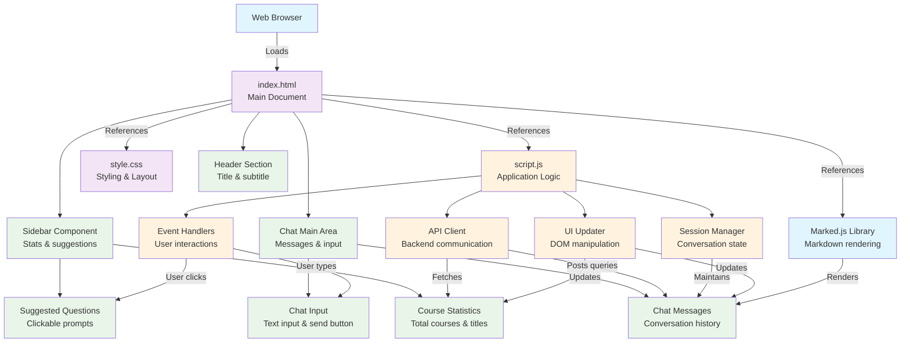
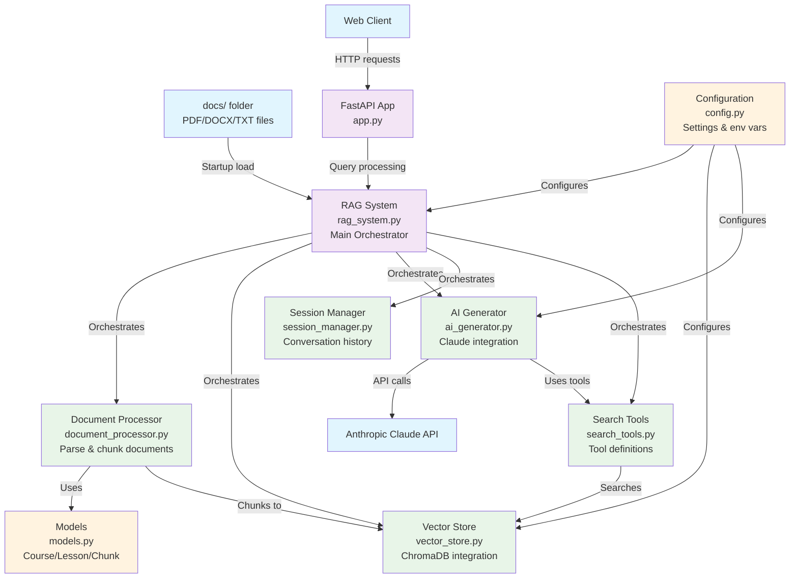

# CLAUDE.md

This file provides guidance to Claude Code (claude.ai/code) when working with code in this repository.

## Development Commands

### Running the Application
- **Quick start**: `chmod +x run.sh && ./run.sh`
- **Manual start**: `cd backend && uv run uvicorn app:app --reload --port 8000`
- **Install dependencies**: `uv sync`

### Code Quality
- **Format code**: `./scripts/format.sh` (Black + isort)
- **Lint code**: `./scripts/lint.sh` (flake8, mypy, format checks)
- **Full quality check**: `./scripts/quality.sh` (format + lint)

### Environment Setup
- Create `.env` file in root with `ANTHROPIC_API_KEY=your_key_here`
- Requires Python 3.13+, uv package manager, and Anthropic API key

### Application URLs
- Web interface: http://localhost:8000
- API docs: http://localhost:8000/docs

## Architecture Overview

This is a full-stack RAG (Retrieval-Augmented Generation) system for querying course materials:

### Backend Architecture (`backend/`)
- **FastAPI application** (`app.py`): Main web server with CORS, static file serving, and API endpoints
- **RAG System** (`rag_system.py`): Core orchestrator managing all components
- **Document Processing** (`document_processor.py`): Handles parsing and chunking of course materials
- **Vector Store** (`vector_store.py`): ChromaDB integration for semantic search
- **AI Generator** (`ai_generator.py`): Anthropic Claude integration with tool support
- **Session Management** (`session_manager.py`): Conversation history tracking
- **Search Tools** (`search_tools.py`): Tool-based search functionality for Claude
- **Models** (`models.py`): Data models for courses, lessons, and chunks
- **Configuration** (`config.py`): Centralized configuration management

### Frontend (`frontend/`)
- **HTML Structure** (`index.html`): Single-page application with sidebar and chat interface
- **JavaScript Logic** (`script.js`): Event handling, API communication, session management, markdown rendering
- **CSS Styling** (`style.css`): Dark theme UI with responsive design and animations

### Frontend Architecture Diagram

### Key Design Patterns
- **Tool-based AI**: Uses Claude's tool-calling capability for structured searches
- **Session-based conversations**: Maintains context across queries
- **Modular architecture**: Clear separation between processing, storage, AI, and web layers
- **Chunked processing**: Documents split into semantic chunks for better retrieval

### Backend Architecture Diagram

### Data Flow
1. Course documents (PDF/DOCX/TXT) loaded from `docs/` folder on startup
2. Documents processed into Course/Lesson objects and text chunks
3. Content stored in ChromaDB with embeddings via sentence-transformers
4. User queries processed through RAG pipeline with session context
5. Claude generates responses using search tools to find relevant content

### Configuration
- All settings centralized in `config.py`
- Environment variables loaded via python-dotenv
- ChromaDB persistence path, chunk sizes, and model settings configurable